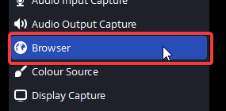
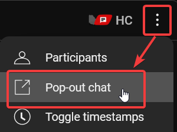
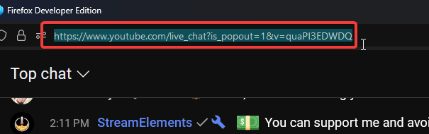
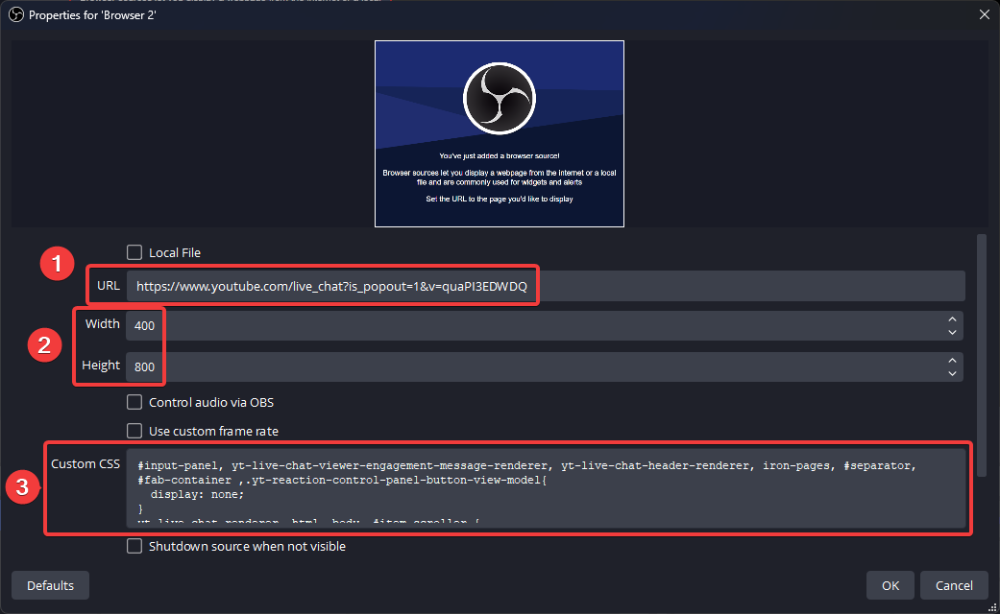
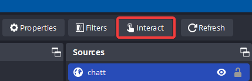
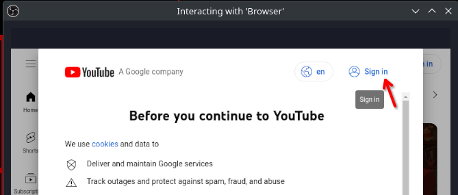

# Custom Style for Youtube Chat in OBS Studio

## Step 1: Create a new browser source 

In a scene, create a new browser source:



## Step 2: Youtube chat URL

Open your stream in your browser, click on the chat popout button and copy the URL.




## Step 3: Enter all the stuff into OBS Studio

In OBS, when creating the browser source, paste the youtube chat URL for the `URL`.

**NEW!!!** When working with the lucky charms on Fuyo's chat we discovered a method to re-direct automatically to the next livechat! Might not work for members if holodex doesn't detect it:

(Yuko Chat URL) https://clovercharms.github.io/holodex-chat-redirect/?apiKey=9273b048-c2a4-4cbc-a6ab-bcc18a036fa9&channelId=UCcIcMRVpNqWQn4WnDhRASAw 

(Pochi Chat URL) https://clovercharms.github.io/holodex-chat-redirect/?apiKey=9273b048-c2a4-4cbc-a6ab-bcc18a036fa9&channelId=UCP0csSl19lOSNwJGCFsJqAQ


If this doesn't work, please resort to copying the livechat url from step 2.

Set `Width` to something like 400. `Height` your choice. (Pochi, please set this to 500!)

Lastly, copy the CSS from this file here [Yuko](yuko-chat.css) [Pochi](pochi-chat.css) into the `Custom CSS` field, delete the default text first.



## Enabling Chat for member streams

In order to enable chat for member streams you need to log into your youtube account. The easiest way to do this:

1. Create a new browser source with the url `youtube.com`
2. Click on `interact` while having the new browser source selected.



3. Click on sign in, enter your email address and your password.



4. Once you confirmed you're logged in, you can remove the youtube browser source. 


DONE!!! 🎉


# Customization (optional)

You can customize the colors yourself in the first paragraph!

```css
:root {
  /* to change backgrounds, text color etc, change the hex values here! */
  --chat-message-text-color: #41464d;
  --chat-message-background-color: #e7e7e7;
  --chat-author-viewer-name-color: #e7e7e7;
  --chat-author-viewer-background-color: #41464d;
  --chat-author-member-name-color: #e7e7e7;
  --chat-author-member-background-color: #6085a2;
  --chat-author-moderator-name-color: #41464d;
  --chat-author-moderator-background-color: #f0bbfe;
  --chat-author-owner-name-color: #41464d;
  --chat-author-owner-background-color: #ffd600;
  ...
}
```
